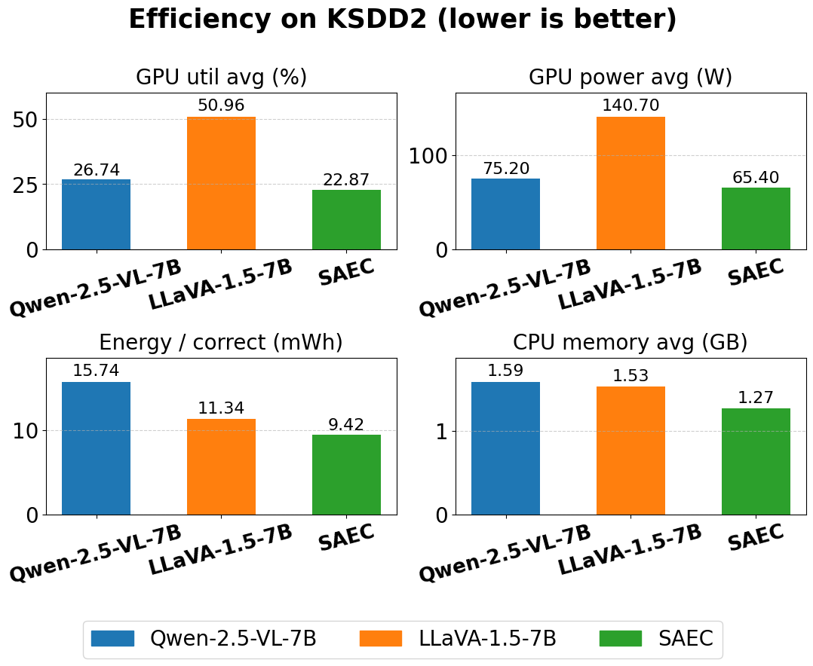
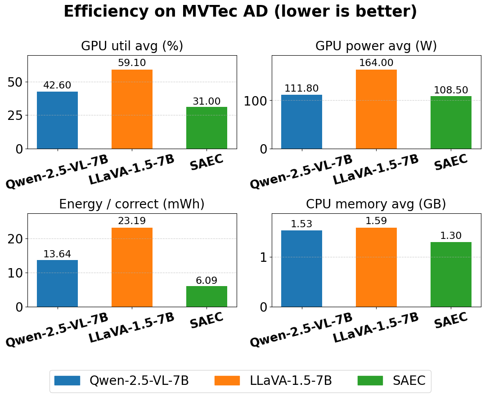

# 🚀 SAEC: Scene-Aware Enhanced Edge-Cloud Collaborative Industrial Vision Inspection with Multimodal LLM

---

## 📑 Table of Contents
- [Summary](#summary)
- [Experiment Setup](#experiment-setup)
- [Environment & Quick Start](#environment--quick-start)
- [Dataset Preparation](#dataset-preparation)
- [QLoRA Fine-tuning](#4bit-qlora-fine-tuning-on-qwen-25l-vl)
- [Edge–Cloud Collaboration Experiments](#edgecloud-collaboration-experiments)
- [Results](#results)

---

## 📝 Summary
A minimal **edge–cloud pipeline** for binary industrial inspection (`good=0`, `defect=1`).  
- **Edge (CPU)**: lightweight YOLOv11s  
- **Cloud (GPU)**: multimodal LLM (Qwen-2.5-VL-7B)  
- **Metrics reported**: Accuracy, Parallel wall time, GPU util avg (%), GPU power avg (W), Energy per correct (mWh), CPU memory avg (GB).

---

## ⚙️ Experiment Setup
- **GPU (Cloud)**: NVIDIA A100 (40 GB)  
- **CPU (Edge)**: 8-core Intel Xeon Platinum 8575C  
- **System**: Ubuntu 22.04 + CUDA 12.4  

> Please adjust dependency versions according to your own environment.

---

## 🔧 Environment & Quick Start
We recommend separate virtual environments (Python 3.10+).

<details>
<summary><b>Setup Qwen (GPU)</b></summary>

```bash
python -m venv qwenenv && source qwenenv/bin/activate
pip install -r requirements/requirements_qwen.txt

# Download Qwen-2.5-VL-7B-Instruct weights
mkdir -p /home/vipuser/models
huggingface-cli download Qwen/Qwen2.5-VL-7B-Instruct   --local-dir /home/vipuser/models/Qwen2.5-VL-7B-Instruct_weights   --local-dir-use-symlinks False --resume-download
```
</details>

<details>
<summary><b>Setup YOLO (CPU)</b></summary>

```bash
python -m venv yoloenv && source yoloenv/bin/activate
pip install -r requirements/requirements_yolo.txt

# Download YOLO11s classification weights
from ultralytics import YOLO
YOLO('yolo11s-cls.pt')
```
</details>

<details>
<summary><b>Setup LLaVA (optional baseline)</b></summary>

```bash
python -m venv llavaenv && source llavaenv/bin/activate
pip install -r requirements/requirements_llava.txt
huggingface-cli download liuhaotian/llava-v1.5-7b   --local-dir /home/vipuser/models/llava-1.5-7b-hf   --local-dir-use-symlinks False --resume-download
```
</details>

---

## 📂 Dataset Preparation

### 🔹 MVTec AD (holdout)
Structure:
```
<OUT>/
  val/
    good/
    defect/
  manifest.json
```
Build holdout:
```bash
/home/vipuser/qwenenv/bin/python build_mvtec_holdout1k.py   --src /home/vipuser/data/mvtec_anomaly_detection   --out /home/vipuser/data/mvtec_cls_holdout1k_v1   --n-good 500 --n-defect 500 --seed 2025
```

### 🔹 KSDD2 (balanced 1:1)
```bash
/home/vipuser/qwenenv/bin/python build_ksdd2_1to1_from_raw.py
```

---

## 🎯 4bit QLoRA Fine-tuning on Qwen-2.5-VL

**1. Data prep**
```bash
/home/vipuser/qwenenv/bin/python prep_mvtec_sft.py   --src /home/vipuser/data/mvtec_anomaly_detection   --out /home/vipuser/data/mvtec_qwen_sft   --defect-train-ratio 0.5
```

**2. Train**
```bash
/home/vipuser/qwenenv/bin/python train_qwen25_qlora.py   --model /home/vipuser/models/Qwen2.5-VL-7B-Instruct_weights   --data /home/vipuser/data/mvtec_qwen_sft   --out /home/vipuser/qlora_qwen25_mvtec   --epochs 3 --bs 2 --ga 8 --lr 2e-4 --use-4bit
```

**3. Evaluate**
```bash
python eval_qwen25_rank_tta.py   --model /home/vipuser/models/Qwen2.5-VL-7B-Instruct_weights   --adapter /home/vipuser/qlora_qwen25_mvtec   --data /home/vipuser/data/mvtec_qwen_sft --imgsz 448
```

---

## ☁️ Edge–Cloud Collaboration Experiments
Run **YOLOv11s (CPU)** + **QLoRA-Qwen2.5-VL-7B (GPU)**.  
Reported metrics: Accuracy, Runtime, GPU/CPU usage, Energy efficiency.

Example (MVTec):
```bash
/home/vipuser/qwenenv/bin/python schemeB_1k_minrun_v4.py   --data /home/vipuser/data/mvtec_cls_holdout1k_v1   --save_dir /home/vipuser/runs_eval/saec_mvtecad   --yolo_env_py /home/vipuser/yoloenv/bin/python   --qwen_base /home/vipuser/models/Qwen2.5-VL-7B-Instruct_weights   --qwen_adapter /home/vipuser/qlora_qwen25_mvtec   --init_q_ratio 0.30 --cpx_size 192 --qwen_batch 24 --qwen_resize 512
```

---

## 📊 Results

### ✅ Accuracy (%)
| Dataset  | YOLO-11s | Qwen-2.5-VL-7B | LLaVA-1.5-7B | **SAEC (Ours)** |
|:---------|---------:|---------------:|-------------:|----------------:|
| MVTec AD | 51.47    | 70.04          | 51.80        | **85.11**       |
| KSDD2    | 45.79    | 61.94          | 51.12        | **82.72**       |

### ⏱ Runtime (parallel wall-clock)
- **KSDD2**
  | Metric                 | Qwen | LLaVA | **SAEC** |
  |------------------------|-----:|------:|---------:|
  | Total time (s)         | 173.6 | 157.0 | **154.2** |
  | Avg time per image (s) | 0.244 | 0.221 | **0.217** |

- **MVTec AD**
  | Metric                 | Qwen | LLaVA | **SAEC** |
  |------------------------|-----:|------:|---------:|
  | Total time (s)         | 222.7 | 200.3 | **172.8** |
  | Avg time per image (s) | 0.230 | 0.207 | **0.179** |

### ⚡ Resource Efficiency
<p align="center">
  <br>
  <em>KSDD2 resource efficiency: lower is better.</em>
</p>

<p align="center">
  <br>
  <em>MVTec AD resource efficiency: lower is better.</em>
</p>
