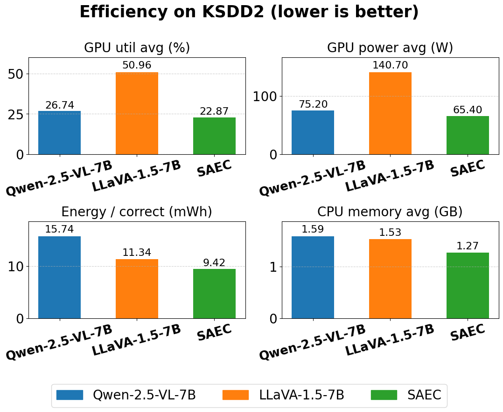

# SAEC: Scene-Aware Enhanced Edge-Cloud-Collaborative Industrial Vision Inspection with Multimodal LLM

## Summary
A minimal edge–cloud pipeline for binary industrial inspection (`good=0`, `defect=1`). A lightweight YOLO runs at the edge CPU, and a multimodal LLM (Qwen-2.5-VL-7B) runs in the cloud. This README mirrors your current structure and commands for quick upload.

## Experiment Setup
All experiments were conducted on a single NVIDIA A100 (40 GB) GPU (cloud) and an 8-core Intel Xeon Platinum 8575C CPU (edge).  
The system runs Ubuntu 22.04 with CUDA 12.4.  

Please adjust dependency versions according to your own environment.
## Environment & Quick Start
We recommend separate virtual environments to avoid dependency conflicts. Python 3.10+ is recommended.

```bash
# Qwen (GPU)
python -m venv qwenenv && source qwenenv/bin/activate
pip install -r requirements/requirements_qwen.txt

#Download Qwen-2.5-VL-7B-Instruct weights to a fixed path
mkdir -p /home/vipuser/models
pip install -U huggingface_hub  # in case it's missing
# If the model is gated, accept license on HF and set HF_TOKEN beforehand.
huggingface-cli download Qwen/Qwen2.5-VL-7B-Instruct \
  --local-dir /home/vipuser/models/Qwen2.5-VL-7B-Instruct_weights \
  --local-dir-use-symlinks False --resume-download
deactivate


# YOLO (CPU)
python -m venv yoloenv && source yoloenv/bin/activate
pip install -r requirements/requirements_yolo.txt

# Download YOLO11s classification weights (pre-download so scripts can point to a fixed file)
python - <<'PY'
from ultralytics import YOLO
# This triggers an automatic download to the Ultralytics cache (~/.cache/ultralytics)
YOLO('yolo11s-cls.pt')
print('downloaded yolo11s-cls.pt to cache')
PY
# Move the cached weight to /home/vipuser/models for consistent referencing
mkdir -p /home/vipuser/models
find ~/.cache -name 'yolo11s-cls.pt' -print -quit | xargs -I{} cp {} /home/vipuser/models/yolo11s-cls.pt
deactivate


# (Optional) LLaVA baseline
python -m venv llavaenv && source llavaenv/bin/activate
pip install -r requirements/requirements_llava.txt

# (Optional) Download LLaVA 1.5 7B weights to a fixed path
mkdir -p /home/vipuser/models
huggingface-cli download liuhaotian/llava-v1.5-7b \
  --local-dir /home/vipuser/models/llava-1.5-7b-hf \
  --local-dir-use-symlinks False --resume-download
deactivate


```


## Dataset downloads and preparation

We use two datasets: **MVTec AD** (https://www.mvtec.com/company/research/datasets/mvtec-ad) and **KolektorSDD2 (KSDD2)** (https://www.vicos.si/resources/kolektorsdd2/).

### MVTec (evaluation holdout)

MVTec is converted into a **binary holdout** with a unified directory structure and an approximately 1:1 class ratio:
  
<OUT>/  
  val/  
    good/  
    defect/  
  manifest.json  
   
The holdout is built **only from the official `test/` split**, ensuring no overlap with the QLoRA SFT training data.

**Build the holdout:**
```bash
/home/vipuser/qwenenv/bin/python /home/vipuser/build_mvtec_holdout1k.py \
  --src /home/vipuser/data/mvtec_anomaly_detection \
  --out /home/vipuser/data/mvtec_cls_holdout1k_v1 \
  --n-good 500 --n-defect 500 --seed 2025  
```
### KSDD2 (direct RAW → balanced 1:1)

Download and unzip **KSDD2** to `/home/vipuser/data/KSDD2_raw/`.
Build a **balanced 1:1 subset** directly from RAW (all defects + equal random goods):
```bash
/home/vipuser/qwenenv/bin/python build_ksdd2_1to1_from_raw.py
```
This creates:  
data/ksdd2_1to1_allDef/val/{good, defect}  
data/ksdd2_1to1_allDef/manifest.json  
runs_eval/splits/ksdd2_1to1_good.txt  
runs_eval/splits/ksdd2_1to1_defect.txt  
  
## 4bit Qlora Fine-tuning on Qwen-2.5L-VL


**1) Data preparation script (train/val JSONL): `prep_mvtec_qwen_sft.py`**

```bash
/home/vipuser/qwenenv/bin/python /home/vipuser/prep_mvtec_sft.py   --src /home/vipuser/data/mvtec_anomaly_detection   --out /home/vipuser/data/mvtec_qwen_sft   --defect-train-ratio 0.5
# The output prints train/val counts, e.g., [done] train=xxxx val=yyyy
```

**2) QLoRA training script (attention + vision projector only): `train_qwen25_qlora.py`**  
4-bit QLoRA training

```bash
/home/vipuser/qwenenv/bin/python /home/vipuser/train_qwen25_qlora.py   --model /home/vipuser/models/Qwen2.5-VL-7B-Instruct_weights   --data  /home/vipuser/data/mvtec_qwen_sft   --out   /home/vipuser/qlora_qwen25_mvtec   --epochs 3 --bs 2 --ga 8 --lr 2e-4 --use-4bit
```

**3) Evaluation script: ranking + multi-crop TTA: `eval_qwen25_rank_tta.py`**  
Evaluation (load QLoRA adapter):

```bash
python /home/vipuser/eval_qwen25_rank_tta.py   --model /home/vipuser/models/Qwen-2.5-VL-7B-Instruct_weights   --adapter /home/vipuser/qlora_qwen25_mvtec   --data /home/vipuser/data/mvtec_qwen_sft --imgsz 448
```
## Edge–Cloud Collaboration experiments

Run **YOLOv11s on CPU** as the *edge* branch and **QLoRA–Qwen2.5-VL-7B on GPU** as the *cloud* branch.  
Reported metrics: **Accuracy**, **Parallel wall time**, **GPU util avg (%)**, **GPU power avg (W)**, **Energy per correct (mWh)**, **CPU memory avg (GB)**.

SAEC:
---

### MVTec AD (1K v1 holdout)

```bash
DATA=/home/vipuser/data/mvtec_cls_holdout1k_v1
RUN=/home/vipuser/runs_eval/saec_mvtecad
PROFILE=/home/vipuser/profile.py
mkdir -p "$RUN"
N_IMG=$(find -L "$DATA/val" -type f \( -iname "*.png" -o -iname "*.jpg" -o -iname "*.jpeg" -o -iname "*.bmp" -o -iname "*.tif" -o -iname "*.tiff" -o -iname "*.webp" \) | wc -l)
/home/vipuser/qwenenv/bin/python "$PROFILE" \
  --gpu 0 --interval 0.2 --images "$N_IMG" \
  --save "$RUN/prof_schemeB_$(date +%m%d_%H%M%S).json" \
  -- /home/vipuser/qwenenv/bin/python /home/vipuser/schemeB_1k_minrun_v4.py \
     --data "$DATA" \
     --save_dir "$RUN" \
     --yolo_env_py /home/vipuser/yoloenv/bin/python \
     --yolo_step2 /home/vipuser/step2_y11n_unsup_cls.py \
     --yolo_weights /home/vipuser/models/yolo11s-cls.pt \
     --mvtec_root /home/vipuser/data/mvtec_anomaly_detection \
     --qwen_base /home/vipuser/models/Qwen2.5-VL-7B-Instruct_weights \
     --qwen_adapter /home/vipuser/qlora_qwen25_mvtec \
     --init_q_ratio 0.30 \
     --cpx_size 192 \
     --yolo_smax_thr 0.55 \
     --yolo_margin_thr 0.03 \
     --yolo_ent_thr 0.95 \
     --yolo_keep_bidir 1 \
     --qwen_thr 0.26 \
     --qwen_batch 24 \
     --qwen_resize 512 \
     --qwen_4bit 0 \
     --qwen_attn flash2

```
### KSDD2 (1:1, “all defects + equal good”)

```bash
DATA=/home/vipuser/data/ksdd2_1to1_allDef
RUN=/home/vipuser/runs_eval/saec_ksdd2
PROFILE=/home/vipuser/profile.py
mkdir -p "$RUN"
N_IMG=$(find -L "$DATA/val" -type f \( -iname "*.png" -o -iname "*.jpg" -o -iname "*.jpeg" -o -iname "*.bmp" -o -iname "*.tif" -o -iname "*.tiff" -o -iname "*.webp" \) | wc -l)
/home/vipuser/qwenenv/bin/python "$PROFILE" \
  --gpu 0 --interval 0.2 --images "$N_IMG" \
  --save "$RUN/prof_schemeB_$(date +%m%d_%H%M%S).json" \
  -- /home/vipuser/qwenenv/bin/python /home/vipuser/schemeB_1k_minrun_v4.py \
     --data "$DATA" \
     --save_dir "$RUN" \
     --yolo_env_py /home/vipuser/yoloenv/bin/python \
     --yolo_step2 /home/vipuser/step2_y11n_unsup_cls.py \
     --yolo_weights /home/vipuser/models/yolo11s-cls.pt \
     --mvtec_root /home/vipuser/data/mvtec_anomaly_detection \
     --qwen_base /home/vipuser/models/Qwen2.5-VL-7B-Instruct_weights \
     --qwen_adapter /home/vipuser/qlora_qwen25_mvtec \
     --init_q_ratio 0.30 \
     --cpx_size 192 \
     --yolo_smax_thr 0.55 \
     --yolo_margin_thr 0.03 \
     --yolo_ent_thr 0.95 \
     --yolo_keep_bidir 1 \
     --qwen_thr 0.26 \
     --qwen_batch 24 \
     --qwen_resize 512 \
     --qwen_4bit 0 \
     --qwen_attn flash2

```

Qwen (base, zero-shot):
---

### MVTec AD (1K v1 holdout)

```bash
PROFILE=/home/vipuser/profile.py
DATA=/home/vipuser/data/mvtec_cls_holdout1k_v1
RUN=/home/vipuser/runs_eval/qwen_mvtecad_$(date +%m%d_%H%M%S)
mkdir -p "$RUN"

N_IMG=$(find -L "$DATA/val" -type f \( -iname "*.png" -o -iname "*.jpg" -o -iname "*.jpeg" -o -iname "*.bmp" -o -iname "*.tif" -o -iname "*.tiff" -o -iname "*.webp" \) | wc -l)

/home/vipuser/qwenenv/bin/python "$PROFILE" \
  --gpu $GPU --interval 0.2 --images "$N_IMG" \
  --save "$RUN/prof_qwen_base.json" \
  -- /home/vipuser/qwenenv/bin/python /home/vipuser/schemeB_1k_minrun_v4.py \
     --data "$DATA" \
     --save_dir "$RUN" \
     --yolo_env_py /home/vipuser/yoloenv/bin/python \
     --yolo_step2 /home/vipuser/step2_y11n_unsup_cls.py \
     --yolo_weights /home/vipuser/models/yolo11s-cls.pt \
     --mvtec_root /home/vipuser/data/mvtec_anomaly_detection \
     --qwen_base /home/vipuser/models/Qwen2.5-VL-7B-Instruct_weights \
     --qwen_adapter "" \
     --init_q_ratio 1.00 \
     --cpx_size 192 \
     --yolo_smax_thr 9.99 --yolo_margin_thr 9.99 --yolo_ent_thr 0.00 \
     --yolo_keep_bidir 0 \
     --qwen_thr 0.26 \
     --qwen_batch 16 \
     --qwen_resize 448 \
     --qwen_4bit 0 \
     --qwen_attn flash2


```
### KSDD2 (1:1, “all defects + equal good”)

```bash
PROFILE=/home/vipuser/profile.py
DATA=/home/vipuser/data/ksdd2_1to1_allDef
RUN=/home/vipuser/runs_eval/qwen_ksdd2_$(date +%m%d_%H%M%S)
mkdir -p "$RUN"

N_IMG=$(find -L "$DATA/val" -type f \( -iname "*.png" -o -iname "*.jpg" -o -iname "*.jpeg" -o -iname "*.bmp" -o -iname "*.tif" -o -iname "*.tiff" -o -iname "*.webp" \) | wc -l)

/home/vipuser/qwenenv/bin/python "$PROFILE" \
  --gpu $GPU --interval 0.2 --images "$N_IMG" \
  --save "$RUN/prof_qwen_base.json" \
  -- /home/vipuser/qwenenv/bin/python /home/vipuser/schemeB_1k_minrun_v4.py \
     --data "$DATA" \
     --save_dir "$RUN" \
     --yolo_env_py /home/vipuser/yoloenv/bin/python \
     --yolo_step2 /home/vipuser/step2_y11n_unsup_cls.py \
     --yolo_weights /home/vipuser/models/yolo11s-cls.pt \
     --mvtec_root /home/vipuser/data/mvtec_anomaly_detection \
     --qwen_base /home/vipuser/models/Qwen2.5-VL-7B-Instruct_weights \
     --qwen_adapter "" \
     --init_q_ratio 1.00 \
     --cpx_size 192 \
     --yolo_smax_thr 9.99 --yolo_margin_thr 9.99 --yolo_ent_thr 0.00 \
     --yolo_keep_bidir 0 \
     --qwen_thr 0.26 \
     --qwen_batch 16 \
     --qwen_resize 448 \
     --qwen_4bit 0 \
     --qwen_attn flash2


```
LLaVA-1.5-7B (zero-shot):
---

### MVTec AD (1K v1 holdout)

```bash
PROFILE=/home/vipuser/profile.py
DATA=/home/vipuser/data/mvtec_cls_holdout1k_v1
RUN=/home/vipuser/runs_eval/llava_mvtecad_$(date +%m%d_%H%M%S)
mkdir -p "$RUN"

N_IMG=$(find -L "$DATA/val" -type f \( -iname "*.png" -o -iname "*.jpg" -o -iname "*.jpeg" -o -iname "*.bmp" -o -iname "*.tif" -o -iname "*.tiff" -o -iname "*.webp" \) | wc -l)

/home/vipuser/qwenenv/bin/python "$PROFILE" \
  --gpu $GPU --interval 0.2 --images "$N_IMG" \
  --save "$RUN/prof_llava_u448_none.json" \
  -- /home/vipuser/qwenenv/bin/python /home/vipuser/eval_llava_base_mvtec.py \
     --base /home/vipuser/models/llava-1.5-7b-hf \
     --data "$DATA" \
     --resize 448 \
     --max_new_tokens 2 --num_beams 1 \
     --tta none \
     --save_csv "$RUN/probs.csv"


```
### KSDD2 (1:1, “all defects + equal good”)

```bash
PROFILE=/home/vipuser/profile.py
DATA=/home/vipuser/data/ksdd2_1to1_allDef
RUN=/home/vipuser/runs_eval/llava_ksdd2_$(date +%m%d_%H%M%S)
mkdir -p "$RUN"

N_IMG=$(find -L "$DATA/val" -type f \( -iname "*.png" -o -iname "*.jpg" -o -iname "*.jpeg" -o -iname "*.bmp" -o -iname "*.tif" -o -iname "*.tiff" -o -iname "*.webp" \) | wc -l)

/home/vipuser/qwenenv/bin/python "$PROFILE" \
  --gpu $GPU --interval 0.2 --images "$N_IMG" \
  --save "$RUN/prof_llava_u448_none.json" \
  -- /home/vipuser/qwenenv/bin/python /home/vipuser/eval_llava_base_mvtec.py \
     --base /home/vipuser/models/llava-1.5-7b-hf \
     --data "$DATA" \
     --resize 448 \
     --max_new_tokens 2 --num_beams 1 \
     --tta none \
     --save_csv "$RUN/probs.csv"

```

## Results

We compare **YOLO-11s**, **Qwen-2.5-VL-7B (base, zero-shot)**, **LLaVA-1.5-7B (base, zero-shot)**, and **SAEC (ours)** on MVTec AD and KSDD2.  
For fairness, all cloud baselines use the same input size (448), no TTA, greedy decoding, and no quantization. Higher is better for accuracy.

### Accuracy (%)

| Dataset  | YOLO-11s | Qwen-2.5-VL-7B | LLaVA-1.5-7B | **SAEC (Ours)** |
|:---------|---------:|---------------:|-------------:|----------------:|
| MVTec AD | 51.47    | 70.04          | 51.80        | **85.11**       |
| KSDD2    | 45.79    | 61.94          | 51.12        | **82.72**       |

### Runtime (parallel wall-clock)

Lower is better.

**KSDD2**

| Metric                 | Qwen-2.5-VL-7B | LLaVA-1.5-7B | **SAEC (Ours)** |
|:-----------------------|---------------:|-------------:|----------------:|
| Total time (s)         | 173.6          | 157.0        | **154.2**       |
| Avg time per image (s) | 0.244          | 0.221        | **0.217**       |

**MVTec AD**

| Metric                 | Qwen-2.5-VL-7B | LLaVA-1.5-7B | **SAEC (Ours)** |
|:-----------------------|---------------:|-------------:|----------------:|
| Total time (s)         | 222.7          | 200.3        | **172.8**       |
| Avg time per image (s) | 0.230          | 0.207        | **0.179**       |

### Resource Efficiency

**KSDD2 — Resource efficiency comparison.** *Lower is better for all metrics (GPU util avg %, GPU power avg W, Energy/correct mWh, CPU memory avg GB).*
<p align="center">
  
</p>
<p align="center"><em>Figure. Resource efficiency on KSDD2.</em></p>

**MVTec AD — Resource efficiency comparison.** *Lower is better for all metrics (GPU util avg %, GPU power avg W, Energy/correct mWh, CPU memory avg GB).*
<p align="center">
  
</p>
<p align="center"><em>Figure. Resource efficiency on MVTec AD.</em></p>

